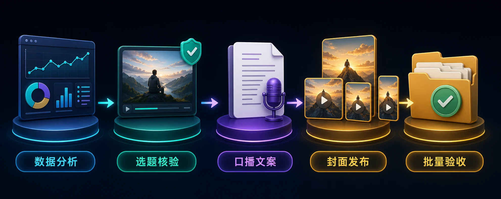

<!-- README-PROMO:START -->
<p align="center">
  
  
  
</p>
<!-- README-PROMO:END -->

# AutoYY — 纪录片解说自动化 Codex Skill

AutoYY 是面向中文纪录片解说创作者的 Codex 自动化技能，将多平台数据分析、YouTube 长视频选题、授权素材与字幕工作流、中文口播稿、短视频封面、发布标题与标签，以及批量交付验收整合为一套可复用流程。文案阶段内置 `blader/humanizer`，每篇口播稿都必须完成去 AI 味审校和事实复检。

AutoYY is a Codex skill for documentary content automation, covering YouTube topic research, yt-dlp and FFmpeg media workflows, Chinese voiceover scripts, cover generation, publishing metadata, and batch validation.

## 核心能力

- 识别并汇总抖音、快手、B站等平台后台截图数据
- 根据历史表现规划纪录片解说选题并验证 YouTube 长视频来源
- 管理已获授权的高清视频、字幕、下载清单与断点续传
- 生成轻松自然、适合直接配音的中文口播稿，并强制通过 Humanizer 去 AI 味流程
- 批量生成短视频封面、25字内发布标题与5个匹配标签
- 自动检查每个选题目录的视频、字幕、文案、封面和发布信息

## 适用场景

适用于纪录片解说、YouTube 长视频二创研究、中文短视频内容生产、批量选题策划、口播文案生成、封面制作和发布素材管理。

## 安装

将本仓库克隆到 Codex 技能目录：

```powershell
git clone https://github.com/DaBaoAgent/AutoYY.git "$env:USERPROFILE\.codex\skills\autoyy"
```

重新启动 Codex 后，可直接提出“使用 AutoYY 分析后台数据并规划下一批纪录片选题”等任务。

## 工作流程

1. 分析多平台作品表现并提炼可复制的选题方向。
2. 搜索、核验并记录时长30分钟以上的长视频来源。
3. 为已获授权的素材准备高清视频、字幕和可追溯下载清单。
4. 生成纯口播中文文案，执行 Humanizer 去 AI 味与事实复检，再制作平台发布标题、标签和两种比例封面。
5. 批量验证目录结构、文件完整性、标题长度和标签数量。

详细规范请参阅 [SKILL.md](SKILL.md)。

## 贡献者

- Dabao
