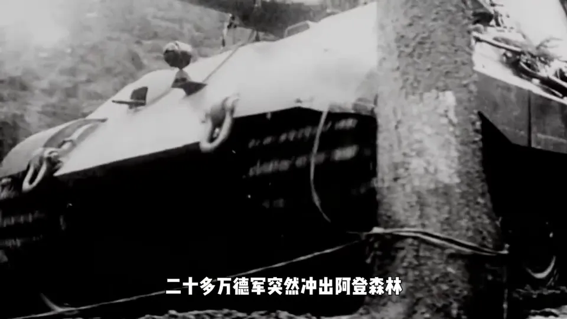
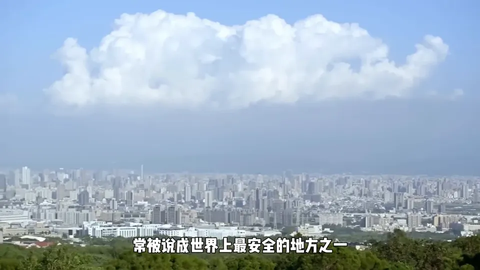
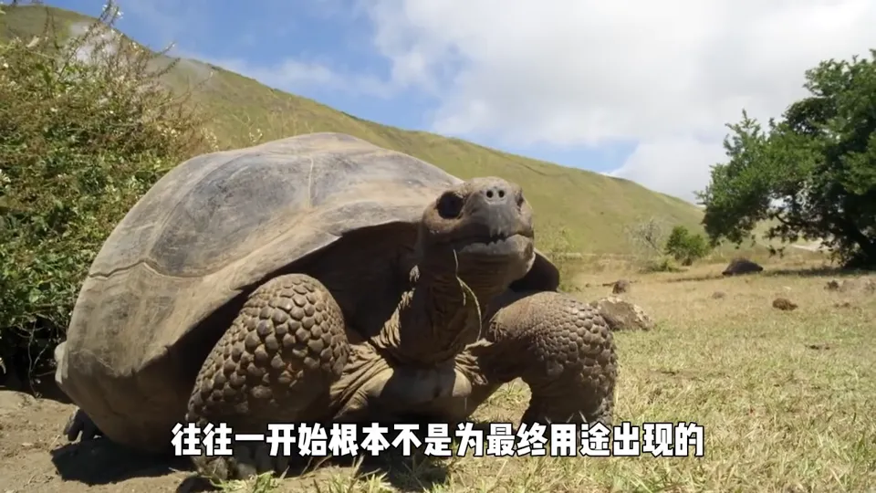
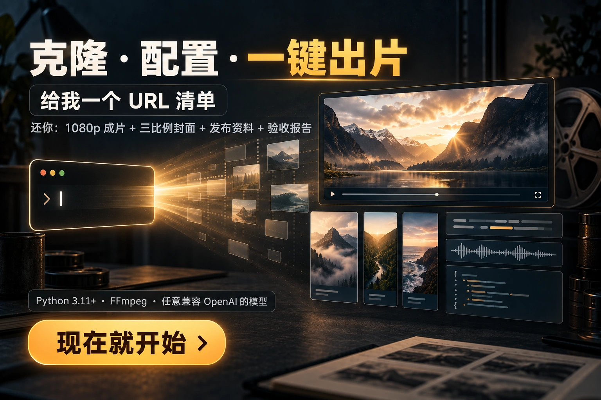

<div align="center">

  

**一条命令，从 YouTube 片源到多平台发布就绪，全程零人工。**

[](LICENSE)
[](https://www.python.org/)
[](../../stargazers)

*核验 → 下载 1080p → AI 爆款文案 → 配音 → 影子匹配 → 自动剪辑 → 硬字幕+BGM → 发布信息 → 三比例封面 → 自动验收*

</div>

---

## 💡 这是什么

刷到这条仓库的你，大概率也想过做纪录片解说号，但被这些劝退过：

- 找片源、下视频、配字幕，一个选题磨掉一晚上
- 文案写得像 AI，配音找不准，剪辑软件学到头秃
- 好不容易发出去，标题封面随手做，播放量随缘

**AutoUP 把整条流水线交给了机器。** 你只需要给一份 YouTube 链接清单，剩下的它跑完：

```bash
python -m autoup.run --manifest 我的选题清单.txt --batch 第一批
```

然后去睡觉。醒来你会得到每个选题一个文件夹：

```
01-大西洋海战/
├── 成片.mp4            ← 1080p 硬字幕+BGM, 直接可发
├── 封面/               ← 9:16 / 16:9 / 1:1 三比例全配好
├── 发布/               ← 国内平台标题标签 / 海外平台英文标题描述
├── 文案/配音/剪辑工程/  ← 中间产物全部留档, 想改哪步改哪步
└── 验收报告.json        ← 14 项自动质检, 全过才算完成
```

## 🎬 效果 Demo（全自动产出，未人工剪辑）

以下三条成片全部由 AutoUP 一键生成：AI 文案 → 配音 → 影子匹配剪辑 → 硬字幕+BGM，全程零人工。点击即看。

| 二战大西洋海战 | 监狱题材 | 自然纪录片 |
|:---:|:---:|:---:|
| [](assets/demos/demo-ww2.mp4) | [](assets/demos/demo-prison.mp4) | [](assets/demos/demo-nature.mp4) |
| ▶️ 点击播放 | ▶️ 点击播放 | ▶️ 点击播放 |

## ✨ 核心特性

<div align="center">
  
</div>

- **🔗 全链路贯通** — 9 个阶段一条命令跑到底，中途失败自动断点续传，重跑同一命令即可接着来
- **🧠 影子匹配剪辑** — 解说文案逐句对齐到原片镜头（基于字幕时间轴语义匹配 + 多重防幻觉护栏），不是乱剪是懂叙事地剪
- **🎙️ 双配音引擎** — GPT-SoVITS 音色克隆（可配多音色）与 edge-tts 免费引擎自动切换，不配参考音频也能直接跑
- **🌏 多平台开箱即用** — 抖音/快手/B站/视频号 + YouTube/TikTok/X 的标题、标签、描述一次生成
- **🛡️ 严格门禁** — 片源不足 30 分钟、不够 720p、没有英文字幕直接拒单，绝不硬做
- **🔍 十四项自动验收** — 分辨率、时长、字幕、音轨、封面比例……机器自己检查完才敢交给你

## 🚀 快速开始

```bash
# 1. 克隆
git clone https://github.com/DaBaoAgent/AutoUP.git
cd AutoUP

# 2. 装依赖
pip install -r requirements.txt   # yt-dlp pydub pillow edge-tts requests pyyaml

# 3. 配一个大模型 API Key(用于文案/匹配, 任选一家兼容 OpenAI 格式的服务)
#    Windows: setx GLM_API_KEY "你的key"   或按 autoup/config.yaml 里的说明填

# 4. 把想做的视频链接丢进一个 txt(每行一个)
# 5. 跑!
python -m autoup.run --manifest urls.txt --batch myfirst
```

> 📘 详细的配置说明（配音音色、封面字体、BGM 曲库、分辨率等）都在 **[autoup/config.yaml](autoup/config.yaml)** 注释里，每一项都有中文说明。
> 📐 想了解架构和原理？看 [docs/requirements.md](docs/requirements.md)（产品设计）和 [docs/research-editing-pipeline.md](docs/research-editing-pipeline.md)（技术选型，源自对 NarratoAI / VideoLingo / MoneyPrinterTurbo 的源码级调研）。

<div align="center">
  
</div>

## 💰 关于收费：没有收费

**AutoUP 是 100% 开源免费的。** MIT 协议，随便克隆、随便改、随便商用，不需要付我一分钱，我也不接受任何形式的"解锁"。

内置 BGM 曲库为 Kevin MacLeod 的 CC-BY 作品（见 `assets/bgm/CREDITS.txt`），发布视频时按说明署名即可，同样免费。

## 🤝 真心话

写这个项目的时候，我把 NarratoAI、VideoLingo、MoneyPrinterTurbo 三个明星项目的源码啃了一遍，能站在巨人肩膀上的地方都站在了肩膀上。它不是玩具——第一支全自动成片我从头到尾没有碰过剪辑软件。

但我知道，**"能跑通"和"你跑得通"之间，可能隔着环境、配置、网络和各种玄学。**

如果你克隆之后卡在某一步，或者压根不想折腾环境——可以联系我，**提供付费一对一教学，远程带着你从装环境到出第一支成片，教会为止**。教过的坑我都踩过了，能帮你少走弯路。

当然，不付费也完全没关系：提 Issue 我看到就会回，能白嫖就痛痛快快白嫖。😄

## 📮 联系我

| 微信 | Telegram | WhatsApp |
|:---:|:---:|:---:|
|  |  |  |
| 扫码加好友 | *@DABAOAGENT001* | *DabaoAgent* |

**📧 邮箱：[xxx139139@gmail.com](mailto:xxx139139@gmail.com)**

- 🔧 部署/使用问题，免费答疑（Issue 或私信都行）
- 🎓 一对一付费教学，手把手教会为止
- 🤝 商务合作 / 定制开发，欢迎聊聊

---

<div align="center">

**如果这个项目对你有帮助，点个 ⭐ 让更多人看到它，就是对作者最大的鼓励。**

*Made with ❤️ by Dabao*

</div>
